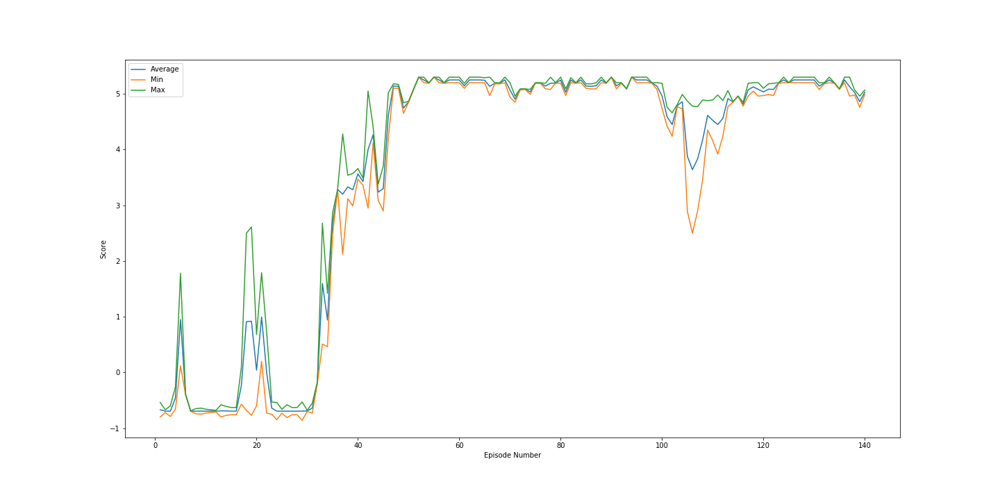

# Multi-Agent DDPG application for a tennis game

### Project Details

 This goal was to develop a competetive MultiAgentRL (MARL) algorithm to do a task on a continous state and continous action space. I have used **Deep Deterministic Policy Gradient** method to solve this problem. I have used a shared replay buffer and two agents share the experiences as their observations are local.

##### Problem Definition

In this environment, two agents control rackets to bounce a ball over a net. If an agent hits the ball over the net, it receives a reward of +0.1. If an agent lets a ball hit the ground or hits the ball out of bounds, it receives a reward of -0.01. Thus, the goal of each agent is to keep the ball in play.

The observation space consists of 8 variables corresponding to the position and velocity of the ball and racket. Each agent receives its own, local observation. Two continuous actions are available, corresponding to movement toward (or away from) the net, and jumping.

The task is episodic, and in order to solve the environment, your agents must get an average score of +0.5 (over 100 consecutive episodes, after taking the maximum over both agents). Specifically,

After each episode, we add up the rewards that each agent received (without discounting), to get a score for each agent. This yields 2 (potentially different) scores. We then take the maximum of these 2 scores.
This yields a single score for each episode.
The environment is considered solved, when the average (over 100 episodes) of those scores is at least +0.5.

```
Number of agents: 2
Size of each action: 2
There are 2 agents. Each observes a state with length: 24
The state for the first agent looks like: [ 0.          0.          0.          0.          0.          0.          0.
  0.          0.          0.          0.          0.          0.          0.
  0.          0.         -6.65278625 -1.5        -0.          0.
  6.83172083  6.         -0.          0.        ]
```
The task is episodic, and in order to solve the environment, the agents must get an average score of +0.5 (over 100 consecutive episodes, after taking the maximum over both agents).

### Solution Description

I have used DDPG to solve this task. Please see `Report.md` for complete details.

### Getting started

</br>

## Installation
### Create the python environment
To set up your python environment to run the code in this zip folder, first create the python environment.

1. Create (and activate) a new environment with Python 3.6.

	- __Linux__ or __Mac__:
	```bash
	conda create --name drlnd python=3.6
	source activate drlnd
	```
	- __Windows__:
	```bash
	conda create --name drlnd python=3.6
	activate drlnd
	```

2. Follow the instructions in [this repository](https://github.com/openai/gym) to perform a minimal install of OpenAI gym.  
	- Next, install the **classic control** environment group by following the instructions [here](https://github.com/openai/gym#classic-control).
	- Then, install the **box2d** environment group by following the instructions [here](https://github.com/openai/gym#box2d).

3. Install several dependencies as mentioned in the enclosed requirements.txt file.
```bash
pip install -r requirements.txt
or
pip3 install -r requirements.txt
```

4. Create an [IPython kernel](http://ipython.readthedocs.io/en/stable/install/kernel_install.html) for the `drlnd` environment.  
```bash
python -m ipykernel install --user --name drlnd --display-name "drlnd"
```

5. Before running code in a notebook, change the kernel to match the `drlnd` environment by using the drop-down `Kernel` menu.

### Download the Unity Environment
Download Unity environment for your system.

* Linux: [click here](https://s3-us-west-1.amazonaws.com/udacity-drlnd/P3/Tennis/Tennis.app.zip)

* Mac OSX: [click here](https://s3-us-west-1.amazonaws.com/udacity-drlnd/P2/Reacher/Reacher.app.zip)

* Windows (32-bit): [click here](https://s3-us-west-1.amazonaws.com/udacity-drlnd/P3/Tennis/Tennis_Windows_x86.zip)

* Windows (64-bit): [click here](https://s3-us-west-1.amazonaws.com/udacity-drlnd/P3/Tennis/Tennis_Windows_x86_64.zip)

* Headless: [click here](https://s3-us-west-1.amazonaws.com/udacity-drlnd/P3/Tennis/Tennis_Linux_NoVis.zip)

### Run the project
Unzip (or decompress) the project archive next to the downloaded unity environment and then.
1. Start the jupyter server
2. Open the Tennis.ipynb notebook
3. Change the kernel to drlnd
4. You should be able to run all the cells

</br>

### Results
The below plot shows the scores during training


The task is solved in 140 episodes with average score greater than 0.50 in 100 episodes.

## Instructions
The main project files are:
* tennis.ipynb - run this file in Jupyter Notebook
* agent.py - the DDPG Agent class, Replay Buffer class and OUNoise class
* deep_network.py - the Actor and Critic Network model architecture.
* checkpoint_actor.pth - actor model checkpoint
* checkpoint_critic.pth - critic trained checkpoint
* Report.md - description of the implementation
* workspace_utils.py - consists of code to make training run for long duration.
* train_result_graph.png - plot of the reward vs episode number.
